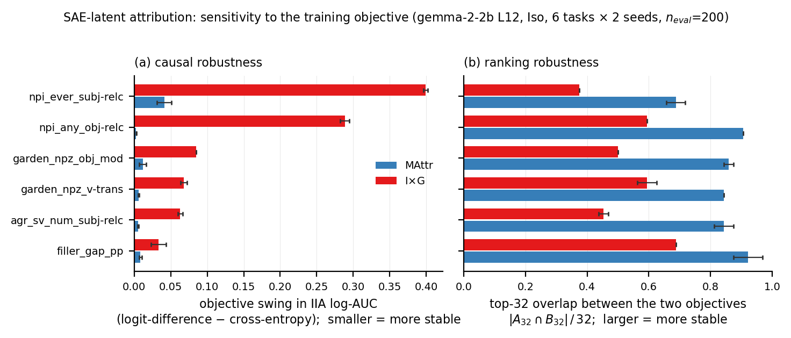
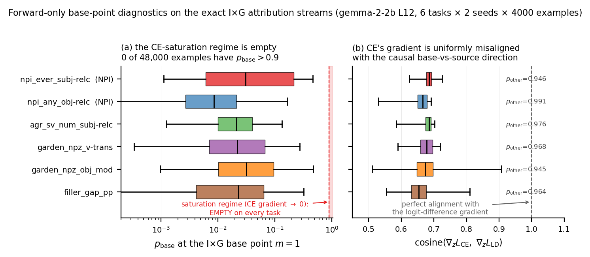
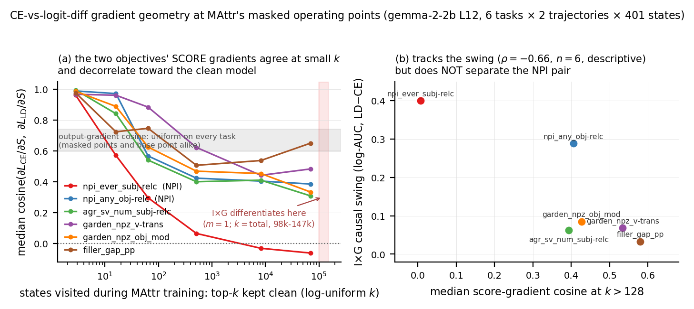

# SAE attribution experiments

MAttr with the latents of a **frozen sparse autoencoder** as the attribution variables — a
learned, overcomplete, non-orthogonal basis — compared against first-order gradient attribution
(I×G) over the same variables: Gemma Scope on the residual stream of Gemma 2 2B, six CausalGym
tasks. The central finding is about **robustness to the choice of attribution objective**, not
about either method uniformly dominating. Numbers are comparable only within a section (sections
differ in seed aggregation, and the appendix pilot uses a different held-out size).

## TL;DR

> - **Causal robustness.** Switching the attribution objective between cross-entropy and
>   logit-difference moves I×G far more than MAttr: the objective-sensitivity contrast is
>   positive on **6/6 tasks and both seeds** (median **+0.068** IIA log-AUC; **+0.29** and
>   **+0.36** on the two NPI tasks). [§2]
> - **Ranking robustness.** The selected variables are also more stable: top-32 overlap across
>   objectives is **0.844** for MAttr vs **0.534** for I×G. [§3]
> - **Mechanism (correlational).** The two objectives' *output* gradients stay ~0.68-cosine
>   aligned at every operating point, but at MAttr's masked states their *score* gradients agree
>   almost perfectly at small k (0.96–0.995) and decorrelate toward the clean-model endpoint
>   where I×G takes its single gradient (down to **0.007** on `npi_ever_subj-relc`). [§5–6]
> - **Interpretation.** In this basis, MAttr's advantage is primarily robustness to objective
>   choice: under logit-difference I×G comes close (MAttr edge median +0.012, positive 6/6). [§7]
> - **Open test.** A k-schedule ablation (**not yet run**) would establish whether training
>   through the strongly-masked states causally produces the robustness. [§8]



*Causal and ranking robustness across attribution objectives. Left: change in IIA log-AUC between
the cross-entropy and logit-difference objectives (smaller = more stable). Right: overlap of the
top-32 SAE variables selected under the two objectives (larger = more stable). Bars are means over
two seeds; error bars span the seeds. MAttr is more stable than I×G on both measures across six
CausalGym tasks.*

## 1. Setup

- **Model / basis:** `google/gemma-2-2b`, layer-12 residual stream (output of the block); frozen
  Gemma Scope width-16k SAE (`average_l0_82`).
- **Variables:** one score per (span, SAE latent) plus a per-span reconstruction-error node.
  Denoising intervention throughout: top-k kept clean, complement patched to the source.
- **Tasks:** six CausalGym tasks × two seeds (0, 1). Two tasks (`npi_ever_subj-relc`,
  `garden_npz_v-trans`) were run first; the other four were **preselected from quantiles of the
  historical 29-task log-k-effect distribution before any MAttr-vs-I×G result on them was
  observed**, to avoid choosing tasks favourable to either method.
- **Methods:** MAttr (soft top-k forward, log-uniform k schedule, 4000 steps) vs I×G over the
  same variable set. Because the intervention
  `new = a_cf + (m ⊙ (f_b − f_cf)) W_dec + m_err(ε_b − ε_cf)` is **exactly affine in the mask**,
  `∂ℓ/∂m` at the base point `m = 1` *is* the paper's I×G score (eq. 21) with the `(h(b) − h(s))`
  factor already inside the derivative; the reconstruction-error node gets eq. 21 with `H` = the
  error term and is deliberately not special-cased. This makes I×G an unusually strong baseline
  in this parameterization — the base–source displacement is represented exactly, and the only
  first-order approximation left is the model downstream of the intervention layer.
- **Objectives:** cross-entropy (CE) and logit-difference (LD) at both seeds, plus the paper's
  soft accuracy as a seed-0 compatibility check (§4).
- **Evaluation:** identical hard-top-k evaluator and k-grid for every method and objective;
  interchange-intervention accuracy (IIA) vs k summarized as log-weighted AUC, on `n_eval = 200`
  held-out examples with train/eval overlap asserted to zero.

## 2. Main result: MAttr is much less objective-sensitive

Values are IIA log-AUC, mean over the two seeds. Robustness contrast =
`[I×G(logit-diff) − I×G(CE)] − [MAttr(logit-diff) − MAttr(CE)]`.

| task | family | robustness contrast | MAttr − I×G (logit-diff) | MAttr − I×G (CE) |
|---|---|---|---|---|
| `npi_ever_subj-relc` | NPI | **+0.3582** | +0.0110 | +0.3693 |
| `npi_any_obj-relc` | NPI | **+0.2860** | +0.0405 | +0.3265 |
| `garden_npz_obj_mod` | garden-path | +0.0733 | +0.0124 | +0.0856 |
| `garden_npz_v-trans` | garden-path | +0.0621 | +0.0295 | +0.0916 |
| `agr_sv_num_subj-relc` | agreement | +0.0577 | +0.0092 | +0.0668 |
| `filler_gap_pp` | filler-gap | +0.0246 | +0.0094 | +0.0340 |

- The robustness contrast is **positive in all 6 tasks and in both seeds** (median **+0.068**,
  range +0.025 to +0.358).
- The matched-logit-diff MAttr edge is **positive in all 6 tasks and in both seeds**
  (median +0.012, range +0.009 to +0.041) — a consistent *small* advantage, not dominance.
- Effect size is **heterogeneous across task families**: the smaller of the two NPI robustness
  contrasts (+0.286) is ~3.9× the largest non-NPI contrast (+0.073). We therefore report the
  per-task distribution — the median headline, not a pooled mean.
- Under CE, **I×G reaches IIA ≥ 0.9 in only 2 of 12 (task, seed) cells**, while MAttr reaches it
  in 9 of 12. Under logit-difference both methods reach it in 11 of 12.


**Caveats.** Two seeds per task; `filler_gap_pp` is the weakest cell (+0.025 mean, seed values
+0.033/+0.016), only ~1.4× its seed spread — positive but not individually resolved. One SAE, one
layer, one model. Not comparable with the Appendix A pilot numbers (different `n_eval` *and*
different training streams).

## 3. The learned rankings are also more stable

Section 2 measures whether the *causal curve* moves when the objective changes; this section asks
whether the methods keep selecting the **same SAE variables**. Every run stores its full score
vector, so this needs zero new model compute, using the evaluator's own ranking convention
(`scores.topk(k)` on the raw signed score — no `abs()`, no normalisation).

Overlap of the top-k selected variables, mean over 6 tasks × 2 seeds:

| comparison | top-8 | top-16 | top-32 | top-64 | top-128 | RBO(.9) | RBO(.98) |
|---|---|---|---|---|---|---|---|
| **MAttr CE↔logit-diff** | 0.885 | 0.870 | **0.844** | 0.729 | 0.649 | 0.885 | 0.795 |
| **I×G CE↔logit-diff** | 0.625 | 0.615 | **0.534** | 0.512 | 0.511 | 0.573 | 0.549 |
| MAttr↔I×G @ logit-diff | 0.708 | 0.745 | 0.773 | 0.750 | 0.760 | 0.768 | 0.756 |
| MAttr↔I×G @ CE | 0.510 | 0.583 | 0.539 | 0.533 | 0.537 | 0.483 | 0.529 |

RBO is rank-biased overlap, `(1−p)·Σ_d p^(d−1)·|A_d∩B_d|/d`, truncated at depth 256.

- **MAttr keeps 0.844 of its top-32 variables when the objective changes; I×G keeps 0.534.** The
  ordering holds task by task and seed by seed: the MAttr−I×G stability gap is positive in 23 of
  24 (task, seed, k∈{8,64}) cells; the single exception is an exact tie, not a reversal.
- The effect is **top-heavy**: MAttr's overlap decays with depth (0.885 → 0.649 from k=8 to
  k=128) while I×G's is flat near 0.51, so at large k the two are much closer.
- The two methods also agree with each other far more under logit-difference (0.773 at k=32) than
  under CE (0.539) — the same objective that separates them causally.
- **Association, not causation:** nothing here establishes that ranking change *produces* IIA
  loss; a common cause (a weaker CE gradient signal) is equally consistent.

The reconstruction-error node is genuinely high-ranked (top-8 in 12/12 MAttr cells under both
objectives, top-64 in all 48) and is retained, matching the evaluator; excluding it shifts the
overlaps by at most 0.052 and changes no conclusion. Full-vector rank correlation is **not**
usable here: I×G leaves ~116k of ~131k coordinates at exactly zero (JumpReLU sparsity), so a
whole-vector Spearman is dominated by tie ordering over variables no method would select — it
returns ≈0.76–0.81 for *all four* comparisons above and even ranks I×G as the more stable method.

## 4. Soft accuracy reproduces the margin-objective result

The paper's third objective, soft accuracy, was run for grid compatibility (seed 0, same protocol
as §2). IIA log-AUC:

| task | MAttr CE | MAttr soft-acc | MAttr LD | I×G CE | I×G soft-acc | I×G LD |
|---|---|---|---|---|---|---|
| npi_ever_subj-relc | 0.7237 | 0.7602 | 0.7548 | 0.3397 | 0.7361 | 0.7421 |
| npi_any_obj-relc | 0.6926 | 0.6975 | 0.6947 | 0.3623 | 0.6653 | 0.6573 |
| agr_sv_num_subj-relc | 0.8253 | 0.8324 | 0.8298 | 0.7532 | 0.8162 | 0.8192 |
| garden_npz_v-trans | 0.6151 | 0.6276 | 0.6219 | 0.5221 | 0.5937 | 0.5946 |
| garden_npz_obj_mod | 0.6775 | 0.6992 | 0.6941 | 0.5940 | 0.6875 | 0.6791 |
| filler_gap_pp | 0.6548 | 0.6677 | 0.6648 | 0.6131 | 0.6574 | 0.6564 |

- **Soft accuracy tracks logit-difference for both methods on all six tasks** (|acc − LD| is
  0.001–0.008 throughout); CE remains the outlier, and far more so for I×G. Objective range
  across the three (max − min): MAttr median **0.013**, I×G median **0.083**; larger for I×G on
  **6/6** tasks.
- MAttr keeps a small positive matched-objective edge under soft accuracy (median **+0.020**,
  positive 6/6), consistent with CE (+0.088) and logit-difference (+0.014). Ranking agrees:
  `acc↔LD` is the most stable objective pair for both methods (top-32 overlap 0.932 MAttr,
  0.875 I×G).

**These are not three independent objective directions.** With
`d = logit[y_base] − logit[y_source]`, logit-difference is `−d` and soft accuracy is `1 − σ(d)`
(up to the repository's additive-constant convention): both are monotone in the *same* scalar, so
their per-example gradients are collinear up to the positive weight `σ'(d)` — verified
numerically (gradient cosine 1.000000 over random logits, vs ≈0.63 between either and CE). Soft
accuracy is therefore a compatibility check with the paper's grid, not a third direction, which
is also why it was not run at a second seed.

## 5. Why CE differs from logit-difference for I×G

I×G differentiates once, at the unmasked base point `m = 1`, where the two objectives have exact
output gradients

```
grad_z L_CE = softmax(z) - e_base        grad_z L_LD = -e_base + e_source
```

The natural explanation for CE's brittleness is **saturation**: CE's gradient vanishes as
`p_base → 1` while the logit-difference gradient has constant norm `sqrt(2)`, predicting CE
should be least reliable where the model is most confident.

I×G is closed-form, so its runs stored no per-example logits. `collect_base_diagnostics.py`
therefore **reconstructs the exact gradient stream** each I×G run consumed — `(task, seed)` fully
determines it — and asserts it against every invariant the original runs recorded (**all 12
streams match exactly**) before running only the base-prompt forward, which at `m = 1` *is* the
I×G base point (the intervention is algebraically the identity there).

**Saturation is refuted.** Over all 48,000 attribution examples (6 tasks × 2 seeds × 4000):

| statistic | value |
|---|---|
| median `p_base` | 0.019 |
| p99 / max `p_base` | 0.399 / 0.695 |
| examples with `p_base > 0.9` | **0** |
| min `‖grad_z L_CE‖ / sqrt(2)` | 0.221 |
| examples with `‖grad_z L_CE‖ / sqrt(2) < 0.1` | **0** |

The saturated regime is not rare on these tasks — it is **empty**.

**What the geometry actually is.** The probability mass sits elsewhere: median `p_source` =
0.0008, median `p_other` = 0.975. Since `grad_z L_CE = p − e_base` weights *every* vocabulary
token while `grad_z L_LD` is supported on `{base, source}` alone,

```
cosine(grad_z L_CE, grad_z L_LD) = 0.677     (p10 0.626, p90 0.699)
```

uniformly across tasks (per-task medians 0.654 to 0.686): roughly **97% of CE's gradient mass is
spent on tokens the interchange intervention never involves**. I×G takes one gradient at this
point and inherits that geometry directly.



**Which tasks swing most is *not* explained by the base point.** The two NPI tasks are large
outliers in I×G's objective sensitivity (log-AUC swing +0.399 and +0.288 vs +0.033 to +0.085
elsewhere), but no base-point statistic accounts for the split:

| candidate | ρ | separates NPI? | gap/range | seeds |
|---|---|---|---|---|
| median `p_base` | +0.143 | no | −0.06 | 0/2 |
| median `‖grad_z L_CE‖` | −0.429 | no | −0.06 | 0/2 |
| median `p_other` | −0.257 | no | −0.02 | 0/2 |
| median CE↔LD cosine | +0.200 | no | −0.01 | 0/2 |
| ranking churn@32 | +0.551 | no | −0.00 | — |
| median `\|margin\|` | +0.486 | YES | +0.39 | 2/2 |
| *(the outcome itself)* | — | YES | +0.56 | — |

ρ is Spearman over n=6, **descriptive only**; with 2 NPI vs 4 non-NPI tasks a random ordering
separates with probability 13.3%, so the normalised gap is the discriminating column (chance
separations are razor-thin, ~0.09, against the outcome's own 0.56). Only `|margin|` separates and
it is fragile — it fails at p75/p90 and mis-orders within groups — so it is recorded as a
correlate, not a mechanism. Ranking churn correlates (+0.551) but does not separate the NPI pair
at all. (Held-out and attribution-stream distributions agree to within 0.004 median cosine on
every task, so none of this is stream-specific.)

This section measures the base point only; the next measures the operating points MAttr actually
trains through.

## 6. The geometry MAttr actually optimises through

The comparison is counterfactual at a **shared state**: at the same scores `S`, the same example,
the same drawn `k`, the same mask, and the same forward pass, both objectives' gradients with
respect to the scores —

```
∂L_CE/∂S   vs   ∂L_LD/∂S
```

— are computed with `torch.autograd.grad` (no optimiser step, no RNG, `.grad` never written), so
they differ only in the objective, and training proceeds as if nothing was measured.
`attribute_sae.py --record-gradient-geometry` records this every 10th step, plus the CE-vs-LD
*output*-gradient cosine at every step. The instrumentation is verified non-perturbing: **all 12
instrumented runs** (6 tasks × {CE, LD}, seed 0) reproduce the original §2 runs' scores
**bitwise**, per-step losses exactly, and IIA log-AUC exactly.

**Masking changes nothing at the output; the mask Jacobian changes everything in score space.**
At the output, the two objectives disagree by the same fixed angle at every operating point:
median per-task cosine 0.656–0.688 over all 4000 masked training states, indistinguishable from
the base point's 0.654–0.686 (§5), and separating no task (ρ = +0.20 against the causal swing).
The score gradients behave completely differently — `cos(∂L_CE/∂S, ∂L_LD/∂S)` at the same masked
state depends strongly on the state's sparsity `k` (tasks sorted by I×G causal swing):

| task | k≤8 | 8<k≤32 | 32<k≤128 | k>128 | k>32768 |
|---|---|---|---|---|---|
| npi_ever_subj-relc | 0.962 | 0.570 | 0.295 | **0.007** | −0.063 |
| npi_any_obj-relc | 0.988 | 0.971 | 0.567 | 0.406 | 0.385 |
| garden_npz_obj_mod | 0.986 | 0.888 | 0.625 | 0.427 | 0.333 |
| garden_npz_v-trans | 0.967 | 0.961 | 0.883 | 0.534 | 0.482 |
| agr_sv_num_subj-relc | 0.995 | 0.841 | 0.540 | 0.394 | 0.308 |
| filler_gap_pp | 0.976 | 0.724 | 0.746 | 0.580 | 0.650 |

On every task, agreement is highest deep in the corrupted regime (k≤8: 0.96–0.995 — with the
caveat that only ~2–3 mask coordinates are undecided there, so near-perfect alignment is partly
forced by dimensionality) and lowest near the clean model (k>128: 0.58 down to **0.007** on
npi_ever_subj-relc, which goes slightly *negative*, −0.03 to −0.06, in the k>2048 tail). Both
trajectories — the run trained with CE and the run trained with LD — give consistent numbers, so
this is a property of the states, not of which objective did the training.

> The objectives remain equally misaligned at the logits everywhere, but the mask→score Jacobian
> makes their score updates highly aligned in the strongly masked regime. I×G differentiates at
> exactly one state — the fully-unmasked `m = 1`, the `k = total` endpoint of this axis, where the
> update directions agree least — while MAttr's log-uniform k-schedule spreads its 4000 updates
> over the entire family of masked states.



**Per-task test (predeclared with only npi_ever and filler_gap observed).** The k>128 score
cosine anti-correlates with I×G's causal swing — ρ = **−0.657** (n=6, descriptive), the strongest
per-task correlate of the swing in these experiments (churn +0.55, `|margin|` +0.49), and unlike
`|margin|` it comes with a mechanism attached — but it does **not** separate the NPI pair:
npi_ever collapses to genuine orthogonality (0.007) while **npi_any (0.406) sits inside the
control range (0.394–0.580) and remains anomalous**. The all-k variant (ρ = −0.714) separates
only at a normalised gap of 0.02, chance-level by §5's yardstick. Control: no masked-point
statistic tracks the MAttr swing (ρ = −0.09; MAttr swings span +0.002 to +0.041 — though the
largest, +0.041, does belong to npi_ever, the geometry-collapse task).

Where npi_ever's orthogonality lives: even at cosine 0.007, the two objectives' score-gradient
*magnitude* profiles remain as correlated as on every other task (abs-cosine 0.666 vs 0.686–0.752
elsewhere; top-256 support overlap 0.797). The disagreement is **sign flips on shared latents** —
the objectives agree on which SAE latents matter and disagree on which direction to push them.

## 7. Interpretation and claims

> In SAE space, MAttr's main advantage over first-order I×G is robustness to the choice of
> attribution objective rather than a uniformly better ranking. Cross-entropy and margin-based
> objectives induce substantially different output gradients (cosine ≈ 0.68), which I×G inherits
> at its single unmasked operating point. MAttr instead optimises through a family of masked
> states; the objectives remain just as different in output space there, but the mask→score
> Jacobian makes their induced score updates highly aligned in the strongly masked regime, with
> agreement falling toward the clean endpoint I×G uses. This is a mechanism-shaped account of
> MAttr's robustness; a k-schedule ablation is still required to establish that training through
> these states is causally responsible.

**Explicitly not claimed:**

- that MAttr dominates I×G, or that I×G fails in SAE space — under logit-difference I×G comes
  within a small margin on every task;
- that three independent objectives were tested — soft accuracy is collinear with
  logit-difference (§4);
- that ranking change causes IIA degradation (§3 is association only);
- that MAttr is objective-invariant (its swings are small, +0.002 to +0.041, not zero);
- that the k-schedule causally produces the robustness — §6 is correlational until the ablation
  in §8 is run;
- that the NPI-sized effect is representative, or that the NPI pair is explained: npi_ever's
  collapse to score-gradient orthogonality is *measured*, not explained, and npi_any looks like
  the controls in every geometric measure (§5–6) while swinging 3–9× more.

## 8. Next decisive experiment: k-schedule ablation

Retrain MAttr with the k-draw restricted to the **large-k regime** (e.g. log-uniform on
`[total/8, total]`), under CE and LD, on the two NPI tasks plus a low-swing control:

- if the objective swing balloons toward I×G's — especially on npi_ever, where large-k score
  gradients are fully orthogonal between objectives — §6's account becomes causal;
- if robustness persists, the schedule account is wrong, and averaging over 4000 examples/steps
  must carry the robustness instead.

A symmetric small-k-only control completes the design. IIA quality and objective robustness must
be reported separately (small-k-only MAttr may be robust yet produce a poor ranking). Roughly
6–12 runs of ~11 min each. **This has not been run.**

## 9. Reproduction

All three objectives, both methods, six tasks (`--loss` drives MAttr, `--grad-loss` drives I×G;
`acc` is the paper's soft accuracy). Seeds 0 and 1 for `ce`/`logit_diff`, seed 0 only for `acc`:

```bash
TASKS="npi_ever_subj-relc npi_any_obj-relc agr_sv_num_subj-relc \
       garden_npz_v-trans garden_npz_obj_mod filler_gap_pp"
for T in $TASKS; do
  D=results/sae_variant_pilot/$T/n200
  for S in 0 1; do for L in ce logit_diff; do
    python scripts/attribute_sae.py --task syntaxgym/$T --n-eval 200 --seed $S \
        --method mattr --variant topk --k-schedule log --loss $L --steps 4000 \
        --output $D/MAttr_${L}_s$S
    python scripts/attribute_sae.py --task syntaxgym/$T --n-eval 200 --seed $S \
        --method ixg --grad-loss $L --grad-examples 4000 \
        --output $D/IxG_${L}_s$S
  done; done
  python scripts/attribute_sae.py --task syntaxgym/$T --n-eval 200 --seed 0 \
      --method mattr --variant topk --k-schedule log --loss acc --steps 4000 \
      --output $D/MAttr_acc_s0
  python scripts/attribute_sae.py --task syntaxgym/$T --n-eval 200 --seed 0 \
      --method ixg --grad-loss acc --grad-examples 4000 \
      --output $D/IxG_acc_s0
done
```

Ranking stability (§3–4) reads the `scores.pt` those runs already wrote — no model compute:

```bash
python sae_pilot/analyze_ranking_stability.py --root results/sae_variant_pilot
python sae_pilot/analyze_ranking_stability.py --root results/sae_variant_pilot \
    --objectives ce acc ld --seeds 0            # soft-accuracy contrasts (section 4)
python sae_pilot/analyze_ranking_stability.py --root results/sae_variant_pilot \
    --exclude-error-node                        # reconstruction-error-node sensitivity
```

Base-point diagnostics (§5). The collector is **forward-only** — it loads no SAE, takes no
backward pass, and reruns no attribution; it reconstructs each I×G gradient stream and asserts it
against the invariants stored by the original runs before doing any GPU work:

```bash
python sae_pilot/collect_base_diagnostics.py --device cuda \
    --grad-examples 4000 --n-eval 200 \
    --results-root results/sae_variant_pilot --out results/sae_base_diag

python sae_pilot/analyze_base_diagnostics.py \
    --diag results/sae_base_diag --root results/sae_variant_pilot \
    --figure sae_pilot/sae_ce_gradient_geometry.png
```

Collection is ~21 min on one A100 for 6 tasks × 2 seeds × (4000 attribution + 200 held-out)
examples; the analysis is pure CPU.

Masked-operating-point geometry (§6). Instrumented re-runs of the §2 MAttr cells (seed 0 only);
the records are observational and the analysis asserts bitwise equality with the original runs
before using them:

```bash
for T in $TASKS; do for L in ce logit_diff; do
  python scripts/attribute_sae.py --task syntaxgym/$T --n-eval 200 --seed 0 \
      --method mattr --variant topk --k-schedule log --loss $L --steps 4000 \
      --record-gradient-geometry --geometry-every 10 \
      --output results/sae_mattr_diag/$T/MAttr_${L}_s0_geom10
done; done

python sae_pilot/analyze_masked_geometry.py --diag results/sae_mattr_diag \
    --root results/sae_variant_pilot \
    --figure sae_pilot/sae_masked_gradient_geometry.png
```

~11 min per run on one A100 (evaluation dominates; the 401 extra gradient pairs add ~20 s of
train time — 290 s vs 274 s for the same run probed at every 100th step).

## Appendix A. Pilot: k-schedule and soft-vs-hard top-k

Precedes everything above; **not numerically comparable with it** (`n_eval = 80` here vs 200
above, and different training streams). Three matched MAttr configurations — A: hard top-k +
uniform k; B: hard top-k + log-k; C: soft top-k + log-k — so A→B isolates the k-schedule and B→C
isolates the soft relaxation. IIA log-AUC:

| Task | Hard + uniform | Hard + log | Soft + log | log-k effect (B−A) | soft effect (C−B) |
|---|---|---|---|---|---|
| npi_ever_subj-relc | 0.5227 | 0.7684 | 0.7669 | **+0.2457** | −0.0016 |
| filler_gap_embed_3 | 0.5396 | 0.5623 | 0.5618 | **+0.0227** | −0.0005 |

- Log-k improves compact SAE attribution on both tasks, dramatically on NPI and weakly on
  filler-gap; the strong/weak pattern matches the historical tied-score sweep (absolute values
  are not comparable — these runs use per-span scores, the sweep used tied scores).
- Soft top-k gives **no measurable difference in this pilot** over hard/STE at fixed log-k — not
  general equivalence: with `n_eval = 80` the evaluation resolution is 0.0125 IIA, and every C−B
  difference observed is at or below one example.
- Two tasks, one seed. `filler_gap_embed_3` has a high random-feature floor (IIA 0.463) and its
  curve has not saturated at the largest k on the grid, leaving little dynamic range.
- Identical hard-top-k evaluation across A/B/C — the arms differ only in how the ranking is
  trained. Same model, SAE, variables, and intervention as §1 (gemma-2-2b, layer 12, width-16k
  `average_l0_82`, per-span scores + error node, denoising); 4000 steps, seed 0.


Reproduce (one arm; vary `--variant` / `--k-schedule` for the others):

```bash
python scripts/attribute_sae.py --task syntaxgym/npi_ever_subj-relc \
    --variant topk --k-schedule log --seed 0 --steps 4000 \
    --output results/sae_variant_pilot/npi_ever_subj-relc/C_soft_log_s0
```

## Appendix B. Implementation notes

What `scripts/attribute_sae.py` adds on top of the repository's canonical components:

- deterministic seeding (`--seed`, covering Python / NumPy / torch / CUDA and the dataset);
- genuine held-out evaluation (a fixed set of distinct examples, fixed before training), with
  train/eval key overlap asserted to zero against the examples training actually consumed;
- training distribution preserved via rejection of held-out examples — training still draws from
  the original generator, rejecting only keys in the held-out set, rather than sampling uniformly
  from a materialised pool;
- canonical log-k and soft-top-k variants (`--k-schedule`, `--variant`, routed through
  `learning_to_attribute.masks.build_mask` rather than a local mask implementation);
- gradient baseline over the same SAE variable set (`--method ixg`, `--grad-loss`,
  `--grad-examples`), reusing `run_intervened` and the evaluator verbatim so only the ranking
  source differs;
- configurable MAttr training objective (`--loss {ce,logit_diff,acc}`) via the canonical
  `learning_to_attribute.losses.attribution_loss`; `ce` is bit-identical to the previous
  hardcoded `F.cross_entropy(logits, base_label)`;
- observational gradient-geometry records (`--record-gradient-geometry`, `--geometry-every`),
  verified to leave training bit-identical (§6).
