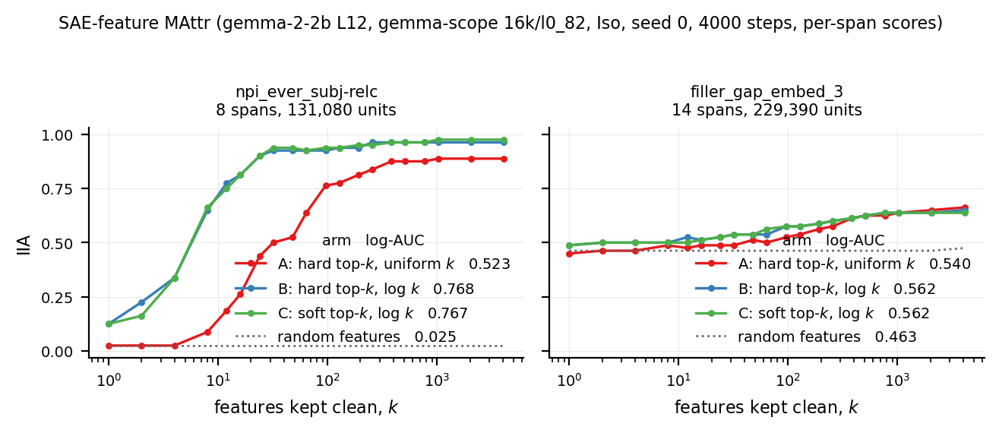
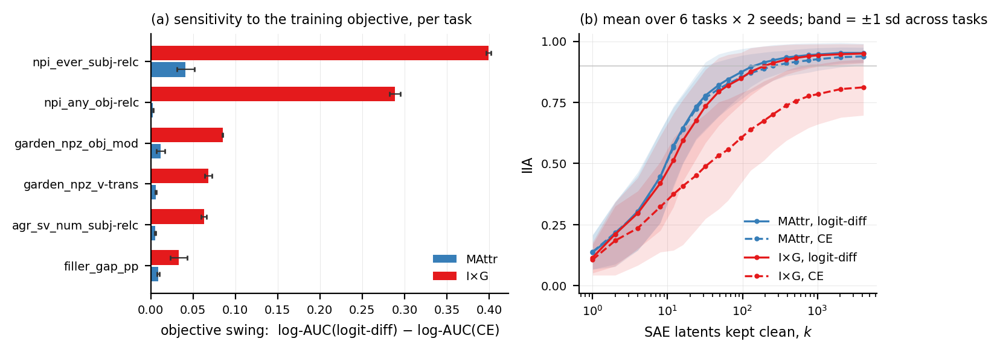

# SAE attribution pilot

## Question

Compare three matched MAttr SAE attribution configurations:

A. hard top-k + uniform k
B. hard top-k + log-k
C. soft top-k + log-k

A→B isolates the k-schedule.
B→C isolates the soft differentiable top-k relaxation.

## Main result

Values are **IIA log-AUC** (log-weighted AUC of interchange intervention accuracy over k).

| Task | Hard + uniform | Hard + log | Soft + log | log-k effect (B−A) | soft effect (C−B) |
|---|---|---|---|---|---|
| npi_ever_subj-relc | 0.5227 | 0.7684 | 0.7669 | **+0.2457** | −0.0016 |
| filler_gap_embed_3 | 0.5396 | 0.5623 | 0.5618 | **+0.0227** | −0.0005 |

- Log-k improves compact SAE attribution on both tasks, dramatically on NPI and weakly on filler-gap.
- Soft top-k gives no measurable improvement over hard/STE at fixed log-k in this two-task pilot.
- The strong/weak task pattern closely matches the historical tied-score sweep, although absolute
  values are NOT comparable because this experiment uses per-span scores.



## Objective robustness: MAttr vs I×G over SAE latents

A gradient-attribution baseline in the same variable set. Because the intervention
`new = a_cf + (m ⊙ (f_b − f_cf)) W_dec + m_err(ε_b − ε_cf)` is **exactly affine in the mask**,
`∂ℓ/∂m` *is* the paper's I×G score (eq. 21) with the `(h(b) − h(s))` factor already inside the
derivative; the gradient is taken at `m = 1` (the base point). The reconstruction-error node gets
eq. 21 with `H` = the error term and is deliberately not special-cased. This makes I×G an
unusually strong baseline in this parameterization — the base–source displacement is represented
exactly by the affine mask parameterization; the remaining first-order approximation comes from
the model downstream of the intervention layer.

**Setup.** Six CausalGym tasks × two seeds (0, 1) × {MAttr soft top-k + log-k, I×G} ×
{CE, logit-difference} = 48 runs. `google/gemma-2-2b`, layer 12, Gemma Scope width-16k
(`average_l0_82`), per-span SAE latent scores plus a per-span reconstruction-error node, Iso
(denoising) intervention, 4000 MAttr steps / 4000 I×G examples, `n_eval = 200`, identical
hard-top-k evaluator and k-grid throughout. Two tasks (`npi_ever_subj-relc`,
`garden_npz_v-trans`) were run first; the other four were **preselected from quantiles of the
historical 29-task log-k-effect distribution before any MAttr-vs-I×G result on them was
observed**, to avoid choosing tasks favourable to either method.

Values are IIA log-AUC, mean over the two seeds. Robustness contrast =
`[I×G(logit-diff) − I×G(CE)] − [MAttr(logit-diff) − MAttr(CE)]`.

| task | family | robustness contrast | MAttr − I×G (logit-diff) | MAttr − I×G (CE) |
|---|---|---|---|---|
| `npi_ever_subj-relc` | NPI | **+0.3582** | +0.0110 | +0.3693 |
| `npi_any_obj-relc` | NPI | **+0.2860** | +0.0405 | +0.3265 |
| `garden_npz_obj_mod` | garden-path | +0.0733 | +0.0124 | +0.0856 |
| `garden_npz_v-trans` | garden-path | +0.0621 | +0.0295 | +0.0916 |
| `agr_sv_num_subj-relc` | agreement | +0.0577 | +0.0092 | +0.0668 |
| `filler_gap_pp` | filler-gap | +0.0246 | +0.0094 | +0.0340 |

**Aggregate.**
- The robustness contrast is **positive in all 6 tasks and in both seeds** (median **+0.068**,
  range +0.025 to +0.358).
- The matched-logit-diff MAttr edge is **positive in all 6 tasks and in both seeds**
  (median +0.012, range +0.009 to +0.041) — a consistent *small* advantage, not dominance.
- Effect size is **heterogeneous across task families**: the smaller of the two NPI robustness
  contrasts (+0.286) is ~3.9× the largest non-NPI contrast (+0.073), so we report the per-task
  distribution rather than a single pooled headline number.
- Under CE, **I×G reaches IIA ≥ 0.9 in only 2 of 12 (task, seed) cells**, while MAttr reaches it
  in 9 of 12. Under logit-difference both methods reach it in 11 of 12.



**Interpretation.** Across six CausalGym tasks, MAttr is consistently less sensitive than I×G to
the attribution objective. The objective-sensitivity contrast is positive in every task and both
seeds (median +0.068 IIA log-AUC). With logit-difference, I×G nearly matches MAttr, although
MAttr retains a small consistent edge on all six tasks; under cross-entropy the gap is
substantially larger. The effect size is heterogeneous across task families, with substantially
larger robustness gaps on the two NPI tasks, so we report the per-task distribution rather than a
single pooled headline number. In this overcomplete basis, what MAttr mainly buys over first-order
attribution is insensitivity to the choice of objective rather than a uniformly better ranking.

**Caveats.**
- Two seeds per task; `filler_gap_pp` is the weakest cell (+0.025 mean, seed values +0.033/+0.016)
  and its effect is only ~1.4× its seed spread, so it is positive but not individually resolved.
- One SAE, one layer, one model; only CE and logit-difference were tested (not soft accuracy).
- **Do not pool these `n_eval = 200` values with the `n_eval = 80` k-schedule numbers above** —
  different held-out sets *and* different training streams.

## Experimental setup

- `google/gemma-2-2b`
- layer 12 (residual stream, output of the decoder block)
- Gemma Scope width-16k SAE, `average_l0_82`
- per-span scores (one score per (span, latent), plus a per-span reconstruction-error node)
- Iso / denoising objective (top-k held clean, complement patched to the source; CE to the base label)
- 4000 steps
- seed 0
- 80 held-out evaluation examples (the k-schedule pilot only; the objective-robustness
  section above uses 200 and is not numerically comparable)
- identical hard-top-k evaluation across A/B/C — the arms differ only in how the ranking is trained

Reproduce (one arm; vary `--variant` / `--k-schedule` for the others):

```bash
python scripts/attribute_sae.py --task syntaxgym/npi_ever_subj-relc \
    --variant topk --k-schedule log --seed 0 --steps 4000 \
    --output results/sae_variant_pilot/npi_ever_subj-relc/C_soft_log_s0
```

## Cleanup relative to old SAE experiment

- deterministic seeding added (`--seed`, covering Python / NumPy / torch / CUDA and the dataset);
- genuine held-out evaluation added (a fixed set of distinct examples, fixed before training);
- train/eval key overlap asserted to zero against the examples training actually consumed;
- canonical log-k and soft-top-k variants supported (`--k-schedule`, `--variant`, routed through
  `learning_to_attribute.masks.build_mask` rather than a local mask implementation);
- training distribution preserved via rejection of held-out examples — training still draws from
  the original generator, rejecting only keys in the held-out set, rather than sampling uniformly
  from a materialised pool;
- gradient baseline added over the same SAE variable set (`--method ixg`, `--grad-loss`,
  `--grad-examples`), reusing `run_intervened` and the evaluator verbatim so only the ranking
  source differs;
- MAttr training objective made configurable (`--loss {ce,logit_diff}`) via the canonical
  `learning_to_attribute.losses.attribution_loss`; `ce` is bit-identical to the previous
  hardcoded `F.cross_entropy(logits, base_label)`.

Reproduce the objective-robustness grid (6 tasks × 2 seeds × 2 methods × 2 objectives = 48 runs):

```bash
TASKS="npi_ever_subj-relc npi_any_obj-relc agr_sv_num_subj-relc \
       garden_npz_v-trans garden_npz_obj_mod filler_gap_pp"
for T in $TASKS; do for S in 0 1; do for L in ce logit_diff; do
  D=results/sae_variant_pilot/$T/n200
  python scripts/attribute_sae.py --task syntaxgym/$T --n-eval 200 --seed $S \
      --method mattr --variant topk --k-schedule log --loss $L --steps 4000 \
      --output $D/MAttr_${L}_s$S
  python scripts/attribute_sae.py --task syntaxgym/$T --n-eval 200 --seed $S \
      --method ixg --grad-loss $L --grad-examples 4000 \
      --output $D/IxG_${L}_s$S
done; done; done
```

## Caveats

- Only two tasks and one seed.
- `n_eval = 80`, so the evaluation resolution is 0.0125 IIA; every C−B difference observed is at or
  below one example.
- The historical sweep used **tied** scores (one score per latent, shared across positions) whereas
  these runs use **per-span** scores, so a given k is a different fraction of the unit set. Compare
  qualitative effects, not absolute AUC or k values.
- The soft-vs-hard result should be described as **"no measurable difference in this pilot"**, not as
  general equivalence — a true effect smaller than the evaluation resolution would be invisible here.
- `filler_gap_embed_3` has a high random-feature floor (IIA 0.463) and its curve has not saturated at
  the largest k on the evaluation grid, so it has little dynamic range for any method to exploit.
