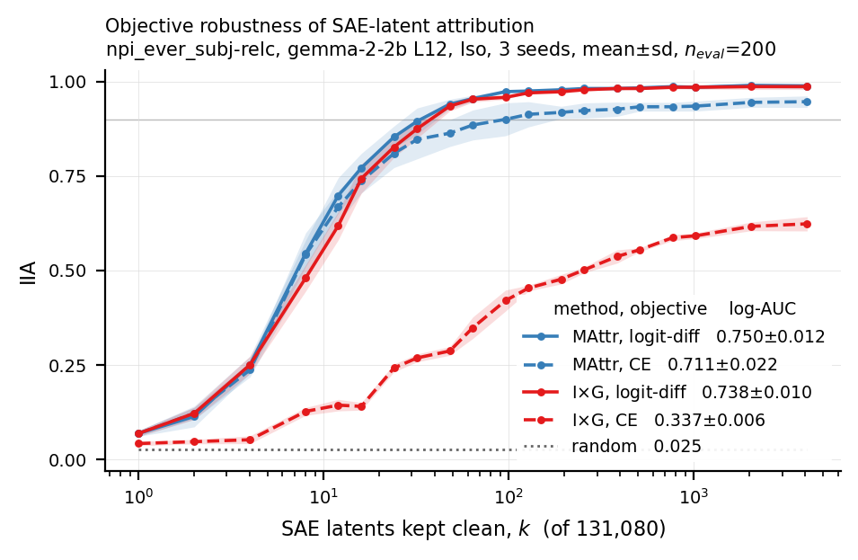

# SAE attribution pilot

## Question

Compare three matched MAttr SAE attribution configurations:

A. hard top-k + uniform k
B. hard top-k + log-k
C. soft top-k + log-k

A→B isolates the k-schedule.
B→C isolates the soft differentiable top-k relaxation.

## Main result

Values are **IIA log-AUC** (log-weighted AUC of interchange intervention accuracy over k).

| Task | Hard + uniform | Hard + log | Soft + log | log-k effect (B−A) | soft effect (C−B) |
|---|---|---|---|---|---|
| npi_ever_subj-relc | 0.5227 | 0.7684 | 0.7669 | **+0.2457** | −0.0016 |
| filler_gap_embed_3 | 0.5396 | 0.5623 | 0.5618 | **+0.0227** | −0.0005 |

- Log-k improves compact SAE attribution on both tasks, dramatically on NPI and weakly on filler-gap.
- Soft top-k gives no measurable improvement over hard/STE at fixed log-k in this two-task pilot.
- The strong/weak task pattern closely matches the historical tied-score sweep, although absolute
  values are NOT comparable because this experiment uses per-span scores.


## Objective robustness: MAttr vs I×G over SAE latents

A gradient-attribution baseline in the same variable set. Because the intervention
`new = a_cf + (m ⊙ (f_b − f_cf)) W_dec + m_err(ε_b − ε_cf)` is **exactly affine in the mask**,
`∂ℓ/∂m` *is* the paper's I×G score (eq. 21) with the `(h(b) − h(s))` factor already inside the
derivative; the gradient is taken at `m = 1` (the base point). The reconstruction-error node gets
eq. 21 with `H` = the error term and is deliberately not special-cased.

All values are **IIA log-AUC, mean ± sd over seeds 0/1/2, `n_eval = 200`**.

| Method | CE | logit-diff | objective swing (ld − CE) |
|---|---|---|---|
| **MAttr** (soft top-k, log-k) | 0.7109 ± 0.0224 | **0.7498 ± 0.0119** | **+0.0389 ± 0.0108** |
| **I×G** | 0.3371 ± 0.0058 | 0.7378 ± 0.0096 | **+0.4006 ± 0.0037** |
| random | 0.0250 | 0.0250 | — |

**Paired objective swings.** Per seed, `[I×G(ld) − I×G(CE)] − [MAttr(ld) − MAttr(CE)]` =
**+0.3618 ± 0.0145**, positive in all 3 seeds — I×G is **10.3×** more sensitive to the objective
than MAttr on log-AUC (13.4× at k ≤ 64, 11.0× at k ≤ 256, 8.7× at the endpoint).

**Matched on logit-diff**, the two methods are close: paired MAttr − I×G = **+0.0120 ± 0.0023**
(positive in all 3 seeds, but ~2.4 examples of 200 — a small effect, not dominance). Matched on
**CE**, MAttr leads by **+0.3738 ± 0.0167**. `k*` (smallest grid k with IIA ≥ 0.9) is identical
between the methods under logit-diff (48/48/32); under CE, **I×G never reaches 0.9 at any k in any
seed**, while MAttr reaches it in all three (64/192/64).



**Interpretation.** In this SAE basis a well-configured I×G nearly matches MAttr; what MAttr buys
is not having to configure it. This is plausibly *because* the mask→activation map is exactly
affine, which is unusually favourable to first-order attribution — more so than the component
bases used elsewhere. Note MAttr is **not** objective-invariant: logit-diff is genuinely better for
it too (+0.039, consistent across seeds), just ~10× less so.

**Caveats.**
- One task so far (`npi_ever_subj-relc`), one SAE and one layer, three seeds.
- Only CE and logit-diff were tested; the soft-accuracy objective was not.
- **Do not pool these `n_eval = 200` values with the `n_eval = 80` k-schedule numbers above** —
  different held-out sets *and* different training streams.
- The `+0.0120` matched-logit-diff gap should not be reported as strong MAttr dominance.

## Experimental setup

- `google/gemma-2-2b`
- layer 12 (residual stream, output of the decoder block)
- Gemma Scope width-16k SAE, `average_l0_82`
- per-span scores (one score per (span, latent), plus a per-span reconstruction-error node)
- Iso / denoising objective (top-k held clean, complement patched to the source; CE to the base label)
- 4000 steps
- seed 0
- 80 held-out evaluation examples (the k-schedule pilot only; the objective-robustness
  section above uses 200 and is not numerically comparable)
- identical hard-top-k evaluation across A/B/C — the arms differ only in how the ranking is trained

Reproduce (one arm; vary `--variant` / `--k-schedule` for the others):

```bash
python scripts/attribute_sae.py --task syntaxgym/npi_ever_subj-relc \
    --variant topk --k-schedule log --seed 0 --steps 4000 \
    --output results/sae_variant_pilot/npi_ever_subj-relc/C_soft_log_s0
```

## Cleanup relative to old SAE experiment

- deterministic seeding added (`--seed`, covering Python / NumPy / torch / CUDA and the dataset);
- genuine held-out evaluation added (a fixed set of distinct examples, fixed before training);
- train/eval key overlap asserted to zero against the examples training actually consumed;
- canonical log-k and soft-top-k variants supported (`--k-schedule`, `--variant`, routed through
  `learning_to_attribute.masks.build_mask` rather than a local mask implementation);
- training distribution preserved via rejection of held-out examples — training still draws from
  the original generator, rejecting only keys in the held-out set, rather than sampling uniformly
  from a materialised pool;
- gradient baseline added over the same SAE variable set (`--method ixg`, `--grad-loss`,
  `--grad-examples`), reusing `run_intervened` and the evaluator verbatim so only the ranking
  source differs;
- MAttr training objective made configurable (`--loss {ce,logit_diff}`) via the canonical
  `learning_to_attribute.losses.attribution_loss`; `ce` is bit-identical to the previous
  hardcoded `F.cross_entropy(logits, base_label)`.

Reproduce the objective-robustness grid (2 methods × 2 objectives × 3 seeds):

```bash
for S in 0 1 2; do
  python scripts/attribute_sae.py --task syntaxgym/npi_ever_subj-relc --n-eval 200 --seed $S \
      --method mattr --variant topk --k-schedule log --loss ce         --steps 4000 --output .../MAttr_ce_s$S
  python scripts/attribute_sae.py --task syntaxgym/npi_ever_subj-relc --n-eval 200 --seed $S \
      --method mattr --variant topk --k-schedule log --loss logit_diff --steps 4000 --output .../MAttr_ld_s$S
  python scripts/attribute_sae.py --task syntaxgym/npi_ever_subj-relc --n-eval 200 --seed $S \
      --method ixg --grad-loss ce         --grad-examples 4000 --output .../IxG_ce_s$S
  python scripts/attribute_sae.py --task syntaxgym/npi_ever_subj-relc --n-eval 200 --seed $S \
      --method ixg --grad-loss logit_diff --grad-examples 4000 --output .../IxG_ld_s$S
done
```

## Caveats

- Only two tasks and one seed.
- `n_eval = 80`, so the evaluation resolution is 0.0125 IIA; every C−B difference observed is at or
  below one example.
- The historical sweep used **tied** scores (one score per latent, shared across positions) whereas
  these runs use **per-span** scores, so a given k is a different fraction of the unit set. Compare
  qualitative effects, not absolute AUC or k values.
- The soft-vs-hard result should be described as **"no measurable difference in this pilot"**, not as
  general equivalence — a true effect smaller than the evaluation resolution would be invisible here.
- `filler_gap_embed_3` has a high random-feature floor (IIA 0.463) and its curve has not saturated at
  the largest k on the evaluation grid, so it has little dynamic range for any method to exploit.
